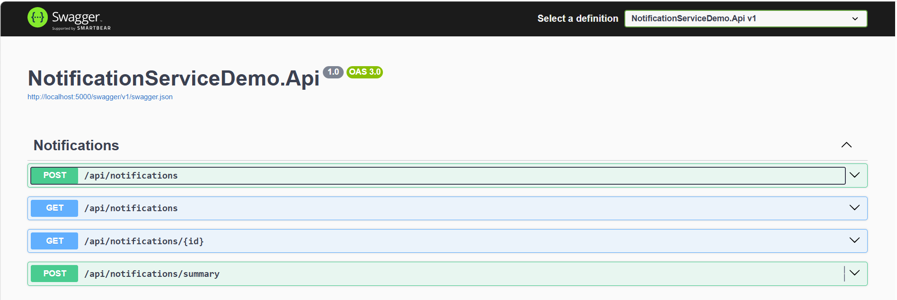
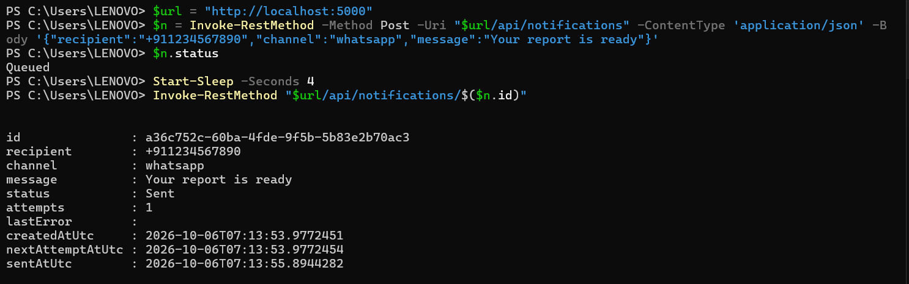
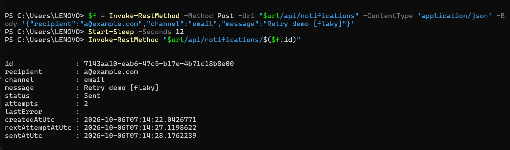
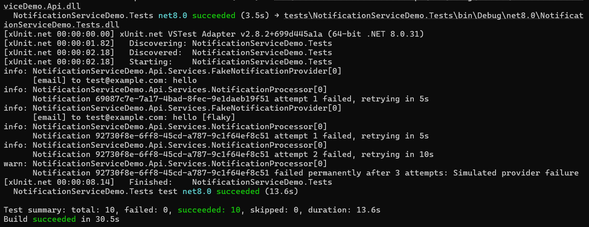

# Notification Service Demo (ASP.NET Core Web API)

A small, self-contained example of a **queued notification service** in ASP.NET Core: requests are accepted immediately, then sent in the background with retries.
It is an original demo project. It uses a fake provider and a generic design, and contains no client or employer code, data or API keys.

## What it shows
- **Queue + background dispatcher** (`BackgroundService`): `POST /api/notifications` returns `202 Accepted` and the message is sent asynchronously
- **Retry with exponential backoff**: failed sends are retried (5s, 10s, ...) up to a configurable maximum, then marked `Failed`
- **Provider abstraction** (`INotificationProvider`): a fake WhatsApp/email provider here, so a real provider (WhatsApp Business API, SMTP, ...) can be dropped in without touching the rest
- **Daily summary job**: a background worker queues a summary of the last 24 hours (sent / failed / queued) once a day; it can also be triggered on demand
- Request validation with proper `400` responses, status lookup, EF Core + SQLite (zero setup), Swagger UI
- xUnit unit and integration tests (the workers are switched off in tests, and "now" is passed in, so retry timing is tested without waiting)

## Requirements
.NET 8 SDK

## Run
```bash
dotnet run --project src/NotificationServiceDemo.Api
```
Open `/swagger` on the address printed in the console.

## Try it (PowerShell)
Use the port from the console output.
```powershell
$url = "http://localhost:5000"   # change the port to match your console

# Queue a notification
$n = Invoke-RestMethod -Method Post -Uri "$url/api/notifications" -ContentType 'application/json' `
  -Body '{"recipient":"+911234567890","channel":"whatsapp","message":"Your report is ready"}'

# A few seconds later it should be Sent
Invoke-RestMethod "$url/api/notifications/$($n.id)"

# Simulate failures: "[flaky]" fails once then succeeds, "[fail]" always fails (retried, then marked Failed)
Invoke-RestMethod -Method Post -Uri "$url/api/notifications" -ContentType 'application/json' `
  -Body '{"recipient":"a@example.com","channel":"email","message":"Retry demo [flaky]"}'

# List by status, and queue the daily summary now
Invoke-RestMethod "$url/api/notifications?status=Failed"
Invoke-RestMethod -Method Post -Uri "$url/api/notifications/summary"
```

## Screenshots
**Swagger UI** (4 endpoints)



**A queued message is picked up by the background dispatcher** (`Queued` → `Sent`, 1 attempt)



**Retry with backoff** (`[flaky]` fails once, retried 5 seconds later, then `Sent` on attempt 2)



**Tests** (10 passing)



## Configuration (`appsettings.json`)
| Section | Setting | Meaning |
|---|---|---|
| `Dispatcher` | `PollIntervalSeconds`, `MaxAttempts`, `BaseDelaySeconds`, `BatchSize` | polling and retry behaviour |
| `Summary` | `Enabled`, `TimeUtc`, `Recipient`, `Channel` | daily summary schedule and target |

## Test
```bash
dotnet test tests/NotificationServiceDemo.Tests
```

## Notes
`FakeNotificationProvider` only logs messages. To go live, implement `INotificationProvider` for your provider and register it in `Program.cs`. Keep real keys in user-secrets or environment variables, never in the repo.
